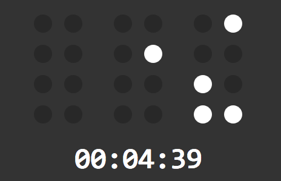

# Binary Pomodoro Clock

## What (the F#$&) is this???

You know Pomodoro clock, right? A tick-a-tock thing that count you down to your coffee time, asking you to go pee every 25 minutes.

This is a simpler version of it, still counting down but does not ask you to go pee.

The problem is, making countdown clock is boring, so I make it less boring by displaying the clock in [binary style](https://en.m.wikipedia.org/wiki/Binary_clock).

## But it hurts my brain...

Deal with it https://www.wikihow.com/Read-a-Binary-Clock

## How to use it?

In two steps:

    $ yarn install
    $ yarn watch

Oh, before that, I assume you already have Elm installed, if not, see this https://guide.elm-lang.org/install.html

## This is so cool, how can I deploy it online?

Take another two steps:

    $ yarn build
    $ cd dist && <deploy it from here, as a static html application>

## Thanks, for hurting my brain!

You're welcome!
